## Straight simple Selection sorts

- unlike bubble, does not respond to order in the data
- just take an item, and move it to the back.
- pattenr of comparisons similar to bubble sort. we exchnage except when item is in the right place.

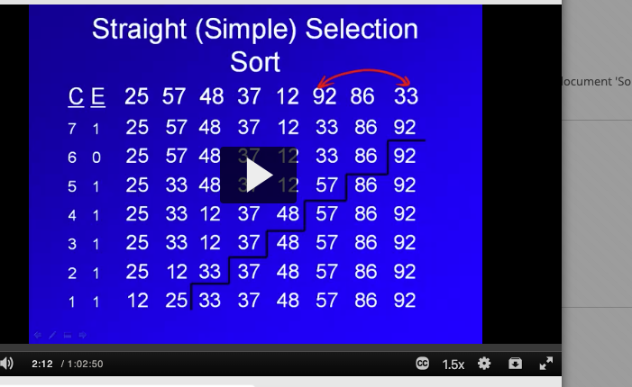

cost is pretty much the smae as bubble, quadratic n^2. doesn't have early out of bubble sort and it doesn't respond to
 order. same amout nof work regardless of order of data. 
 
 
#### binary tree sort (selection sort)
 - arrange binary tree in tree.
 - then do in order traversal to get the sorted numbers.
 
 What is the cost: to build tree + do in order traversal. in order traversal is linear.. you print item just once so the cost is n. what about building a tree? item at worst case is item at bottom fo three so cost is height of the tree so an item is logn and you need to do that n times. so nlogn. overall cost: n + nlogn for binary tree sort.
 
  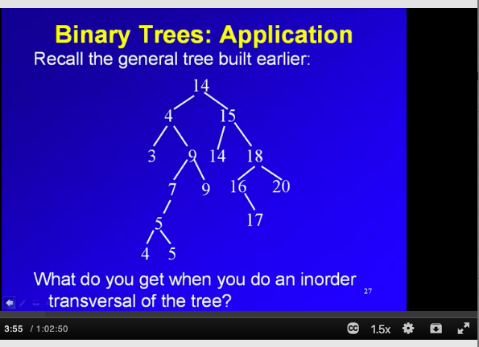
#### heap sort (selection sort)
- more efficient, not as efficient as quicksort.
- uses array representation of tree.
1. build max heap
2. generate sorted list.

start off with array of random numbers, make a heap in the array, sort them in same array.

O(n * logn) is the cost across teh board. in order data is worse than reverse ordered data because of the heap.

#### Quadratic selection sort (selection sort)
- takes extra space so selection sort works better because it's on a smaller amount of data. 
- k =4 , so divide the original file into 4 subfiles. use the black aux array to store the largest of each subfile.
- then from aux file, pull largest and put it in the final sorted array. replace it with the next largest number from the subfile from where it came.
- final new largest item from the subfile, put it in the aux file.

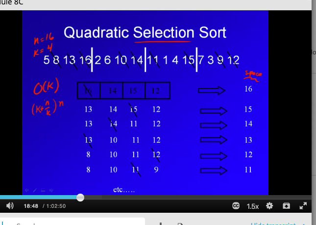

What k should you use? there is an optimal k, but if k is too big it gets worse.nadir is approx sqrt(n)

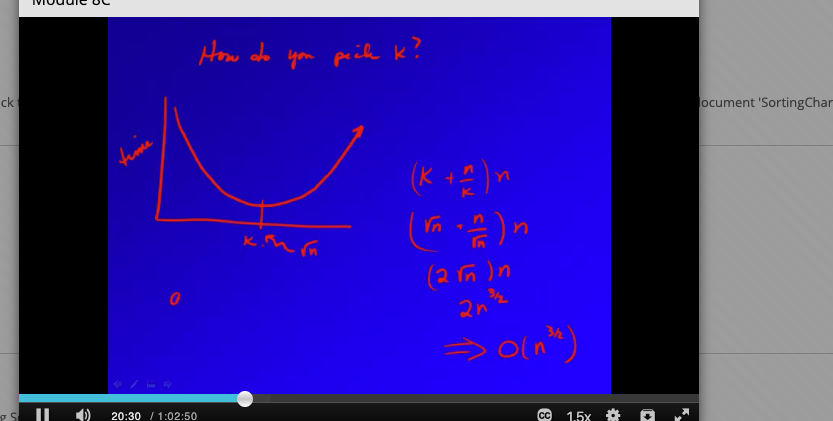

## insertion sort
- needs to be linked implementation
- items that are bigger are less work to insert.

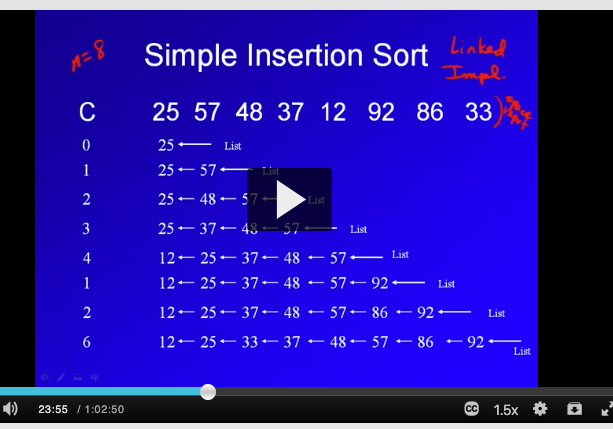

- very responsive to ordering in data, in order data is that each item has to require 1 comparison to insert at teh beginning of the list so it'd be o(n). 1,2,3,4,5 is best.
- reverse data is a lot worse. every single item requires to max comparisons to insert and so O(n^2).
- performance on avg is n^2, quadratic. similar to bubble sort.

#### shell sort
- works best on small files
- use insertion on small sub files.
- multiple passes.

n= 16, k =4 , where k is number of subfiles.

k tells us how far ot jump to get next item in same subfile. that's the light blue number. need array to jump.
algo:
1. apply insertion for each subfile to sort each subfile.
2. once down with subfiles, insert them back into main array by taking smallest of each one and putting them back into main array, then the second smallest of each, etc. main array is now more sorted than before.
3. halve k and repeat and reassemble. 
3. finally do an insertion sort on main array which is essentially k = 1.

optimal ks?
- use knuth sequence which basically gives us the spacing of k to use that are relatively prime, but better than prime because there's a formula for deriving the next number. with primes, that is really hard to do. knuth is easily generated.

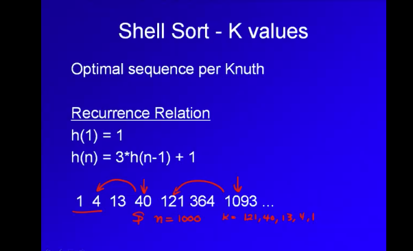

**summary**: 
cost: n(logn)^2
- leverages insertion sort
- needs tobe done in an array
- no sensitive to order

#### merging straigt 2 way
- basis for external sorting, which use higher order but 2 way merge is close.

- assumes 2 pieces, both sorted already. merging assumes 2 pieces, k - way merge assumes k pieces.
- compare the first elemnet in 2 pieces, take smallest, send to output array which is extra space.
- that's the basic merge. if piece is size x, and another is size y. we need extra space of x + y to merge into.

If we had a real problem: 
- so if we have a single of size 16, we can pretend it's 16 pieces of size 1. We do this because merging needs the pieces to be sorted and a piece of size 1 is trivially sorted.
- we then merge to 8 pieces of size 2. merge again so 4 pieces of size 4, etc. finally 1 pieces of size 16 which is totally sorted.

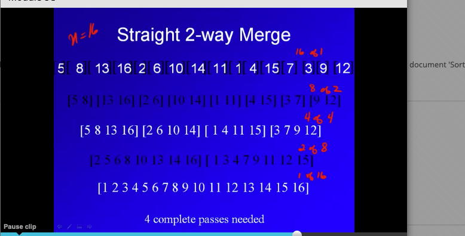

cost:
- we made pieces of size 1, then 2, then 4, then 16 and n = 16. so we made 4 passes. so log(n) for the passes.
- work on each pass: every item gets merge on every pass so cost of single pass is o(n)
- total cost is log(n) * n. O(n(logn))

** summary**:
- can be done wiht arrays or lists
- requires extra space for the output.
- total cost is log(n) * n. O(n(logn))
- data ordering makes no difference because of the process of making subfiles. same amount of work regardless of data order.

#### natural merge
- leverage order in data, exploits the order.
- uses replacement selection, to create original pieces that we do the merging with.

one pass at beginning to create subfile. we restart a subfile when the number get smaller.

6 subfiles here:

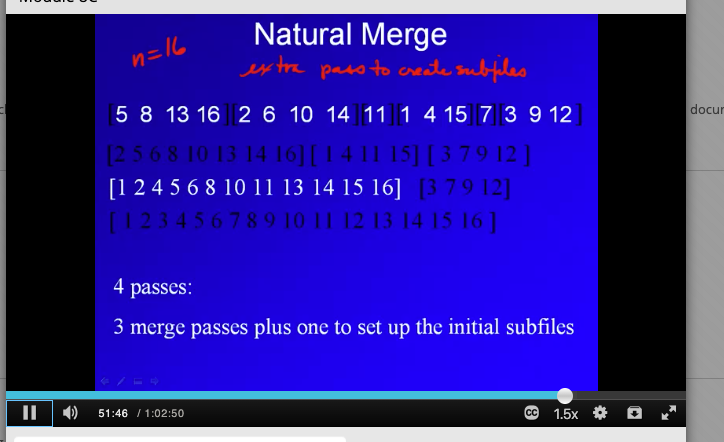

now we have 6 subfiles, we can do the passes.

**Summary**:
- for random file, about the same as straight merge.
- for in order files, much better. O(n) in ordrered, you pass through and end up with 1 subfile and when you have 1 subfile, you're done.
- reversed file, quadratic. n files of size 1. then you have to merge. O(n^2)

#### Radix sort
- positional sort. you break down into columns and pass on each column. passes is a function of number of columns.
- sort from last column and every other number comes along for the ride in the number. Like this:

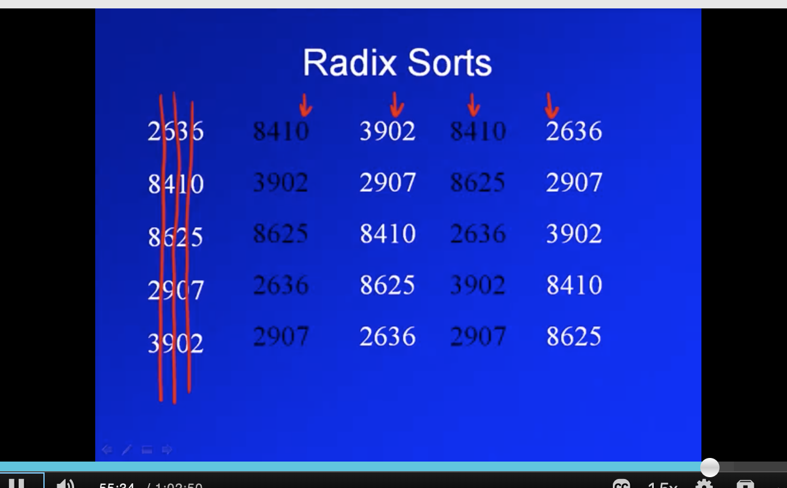

How do you sort hte columns on each pass? use something called counting sort, a linear sort, given the right conditions.

pad letters if some things are shorter in length, but weirdly you shoudl not move the items if there are duplicates in the sort. this is a stable sort -stay in positional order if they are duplicated so at end, haven't messed up columns that we did before.. Basically when things tie in a column, preserve the order.

the red column is correct
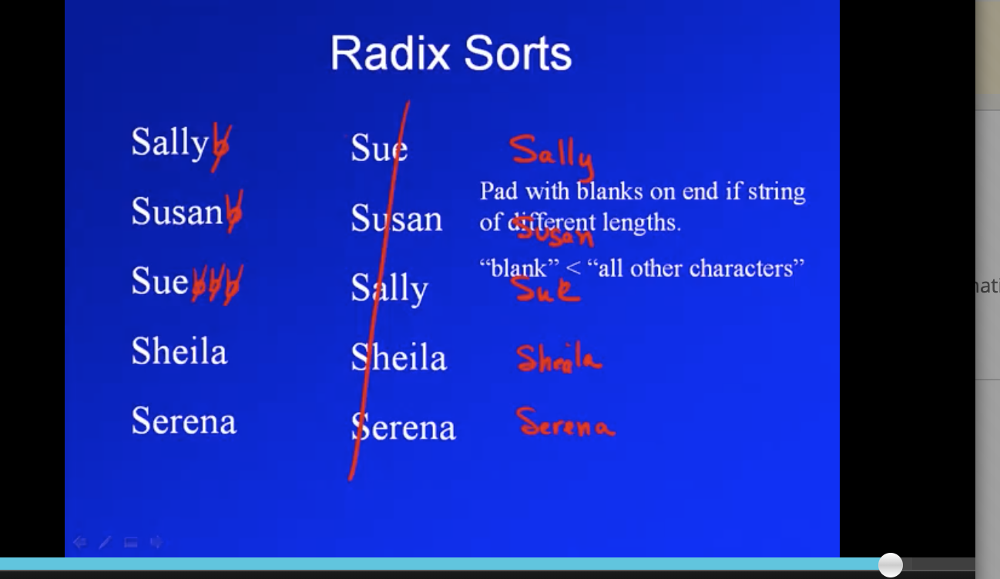

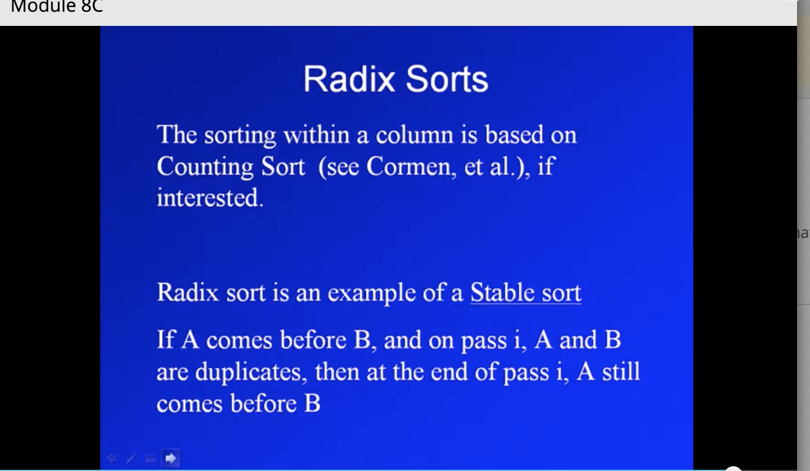

#### Counting sort

How do you beat lower bound cost of sorting n * logn . It does not involve comparisons!

How it works? It assumes you are working with a fixed range of values from 0 to k and that you're sorting n of these values., sorting n of these values.

aux facilities the sort. input and output are indexed from 0 to n long. n is just the number of values we're sorting. the aux is from 0 to k where is the upper bound of possible values.
-  For example, sorting values 0 to 9 so C is from 0 to 9 indicies. A has say 6 of these values so the indicies of A are from 1-6

Algo:
- note that the input array is indexed from 1  and the aux is from 0.
- the aux array (c) has the index, A has the value. In B the output array
- we first label every value in C  == 0. We then increment C by 1 based on the index of A. the values in A are the index and C is the count of that vlaue by index. If A is the first value in A, we increment C[4] by 1.
- cumulatively sum up values in C. if C reads 0,1,1,3, then the new C is 0,1,2,5.
- we start from right of array A (input).
- we see a 5 in array A on the right, 
- go to index 5 in C, not that there's a 5 there, decrement by 1 to 4. we write the value in A in the index of B[C].
- The 8 in A means we look in index c[8] which == 7. So B[7] = 8. 

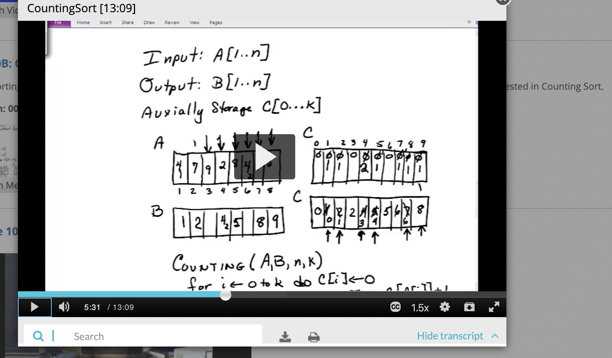
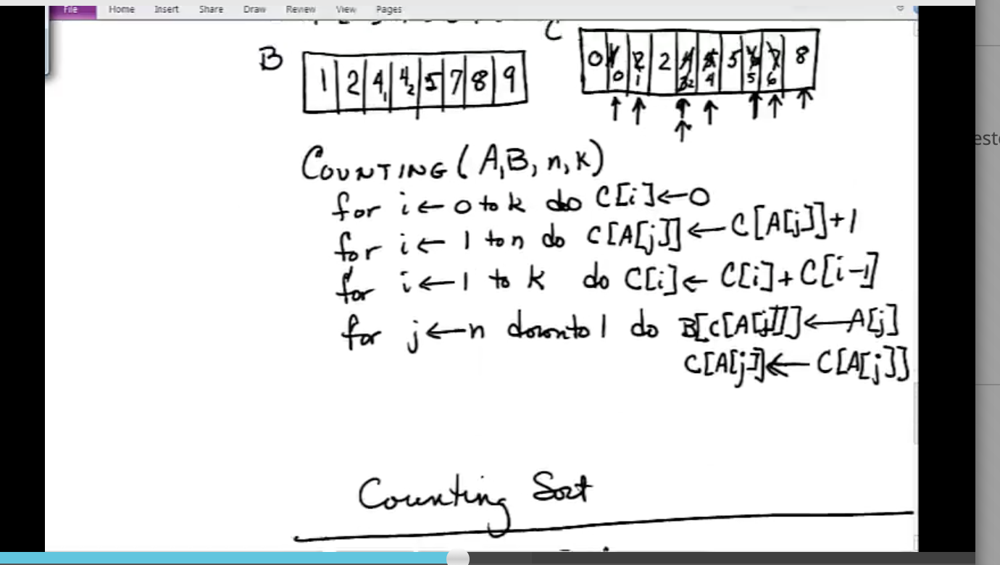

costs:
- cost of creaeting C (which is valued 0 to k) and making them all 0s is cost linear in terms of k. O(k)
- incrementing C using vlaues of A (valued from 1 to n) is linear in terms of n so O(n).
- cumulatively summing values in aux is O(k) again.
- look up iterms in C, look up in C for location. is linear in terms of n (size of A) so it's O(n).
total cost:2k + 2n. so O(n) + O(k). But k is usually some function of O(n) so cost is O(n)

**Summary:
- stable - duplicates remain in order in the output array as they were in the input array.
- O(n) is avg cost. linear!

#### Radix sort is based on counting.
- alphanumerica can be turned into numerical data.

cost of radix is d * cost of counting sort = d * O(n) where d is number of columns. on each column you use counting sort.

#### Searching

- retrieving a record for updating or use in computatino.. range from O(1) to O(n). sorting is O(n) to O(n^2). seearching is easier... jsut finding 1 item in file of size n so intuitively it should be easiser.

- record = unit of data
- file (of size n) collection of units. not a system file. collection of records.
- a key is the  portion of data record that we use for retrieval. we use the key to find a record. 
- primary key vs secondary. primary keys are unqiue.
- external keys are when we store it outside of the record. we store it outside of the record, but if separated, got a problem of keeping a link.
- external searching vs internal searching. is it small enough to bring it into main memory?

searching relies on data being sorted. some unsorted.

### searching when sorted
- anytime changes to data, need to sort again.

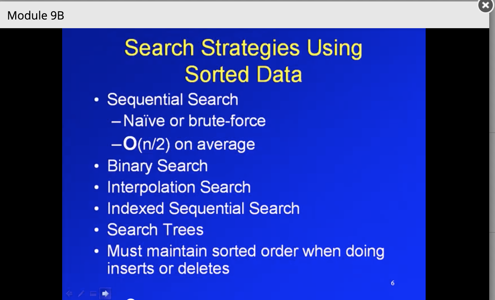

- sequential search, binary, interpolation search, search trees, 
- if a lot of insertions and deletions, thne need to be efficient.

#### sequential search:
- if you delete, you have to shift rest of records
- you could instead of resorting upon deleting, just mark the area in the area which makes deletions faster. Does not affect retrieval time.

#### Binary search

- need to use an array. Need to find middle element. cannot use dynamically allocated space with a linked list.
- O(logn) on avg because you can throw away half of file on each search so number of items that falls off grows quickly. 

### Interpolation search
- cousin to binary search
- uses linear interpolation on the key.

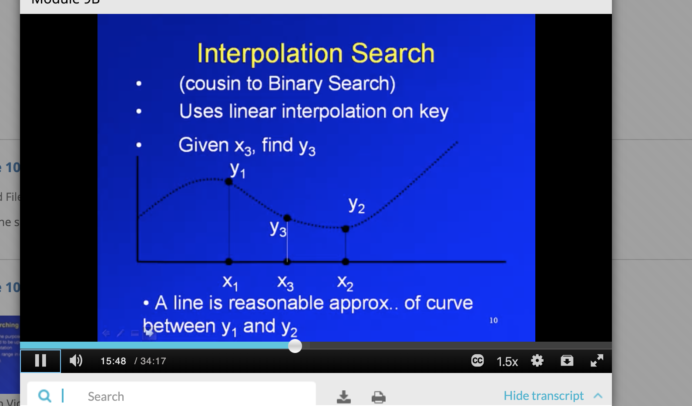

find y3 by using y2 and y1... it's close enough to just use the slope between y1 and y2.
In searching, y coordinates the addresses, and x coordinates are the keys. 

- what needs to be true for this to work well? keys msut be uniformly distributed in a range of locations. 50 keys can't be stored in first 50 locatinos in 100 locations.

**Summary**:
- cost: log(logn), if not can be as bad as O(n). 
- requires keys to be uniformly distribued across search space.
- if not, interpolation will not get us to desired location and will be as bad as O(n).

### index sequential search.
- uses an index.
- remember a file is a list of records or items, not a file on a file system.
index: a small file, that contains a subset of the files. It allows us to jump into the main file and start search from there. It has record and its location in the main file and the search would star there and so you wouldn't have to look at the entire file.

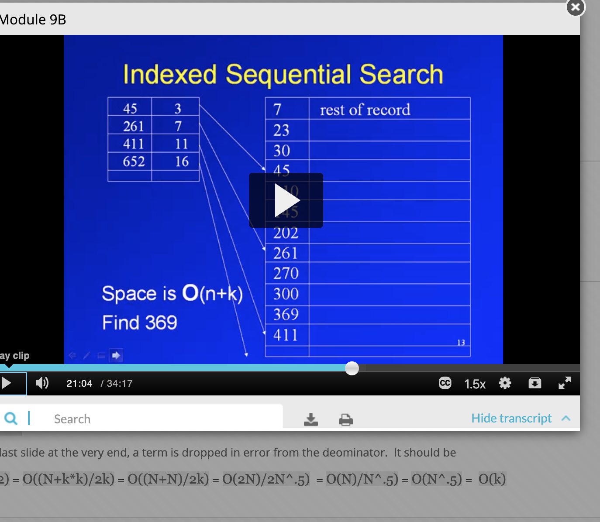

So in the above, if you were looking for 300, you know that 300 is greater than 45 in the index and 261 in the index, but not greater than 411 so you'd start at index 7 in the main file to look for 300. 
- you wouldnt have to seuentially look at whole file.

Cost: you search index and the main file starting at the index specified by the file.

over time, this helps! but you do have to search two files. the index and the main file.

- index only contains key (the vlaue) and the index of the record.

**Summary**:
- needs extra space to store index. O(n+k) where k is size of index. cost is searching index and searching the piece indentified by the index.
- index could be stored for binary search.
- rest of file can be array or list, static or dynamic allocation.
- get file pieces all of the same size, that's optimal.
- need ot make sure index gets you to even places in the jump file.. need to make sure the pieces created by the index in the jump file are even.. if you do lots of insertions and deletions, the pieces might be uneven so you have to rebuild.

