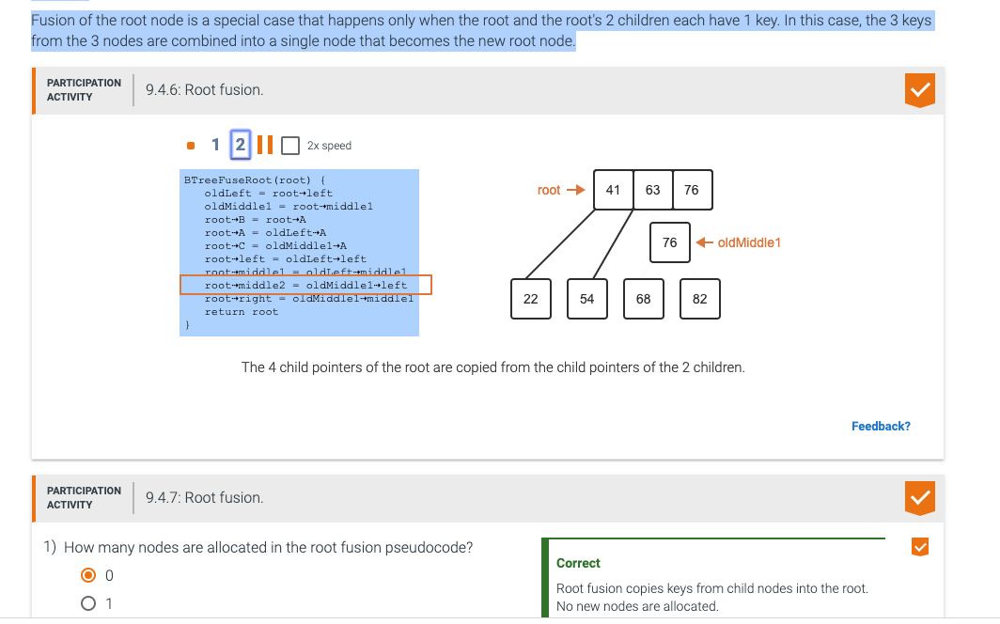
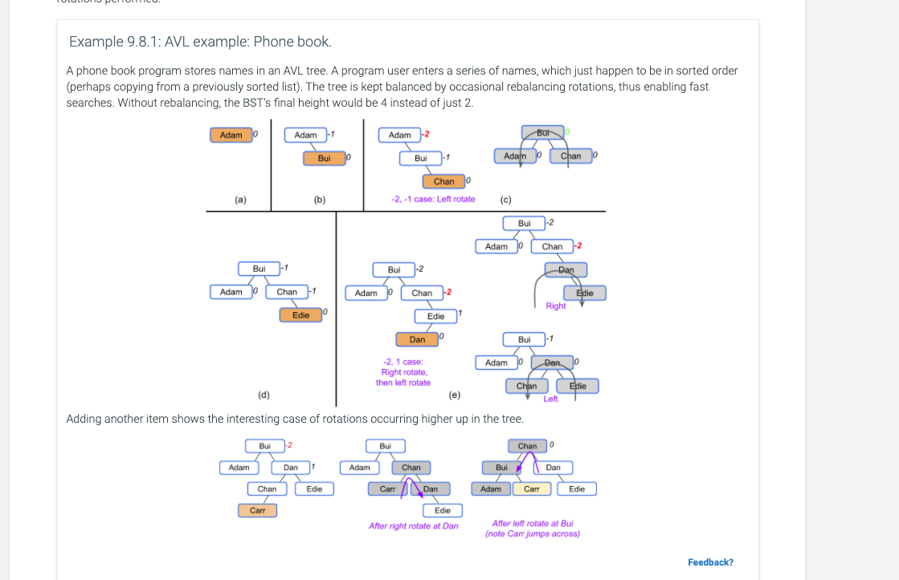
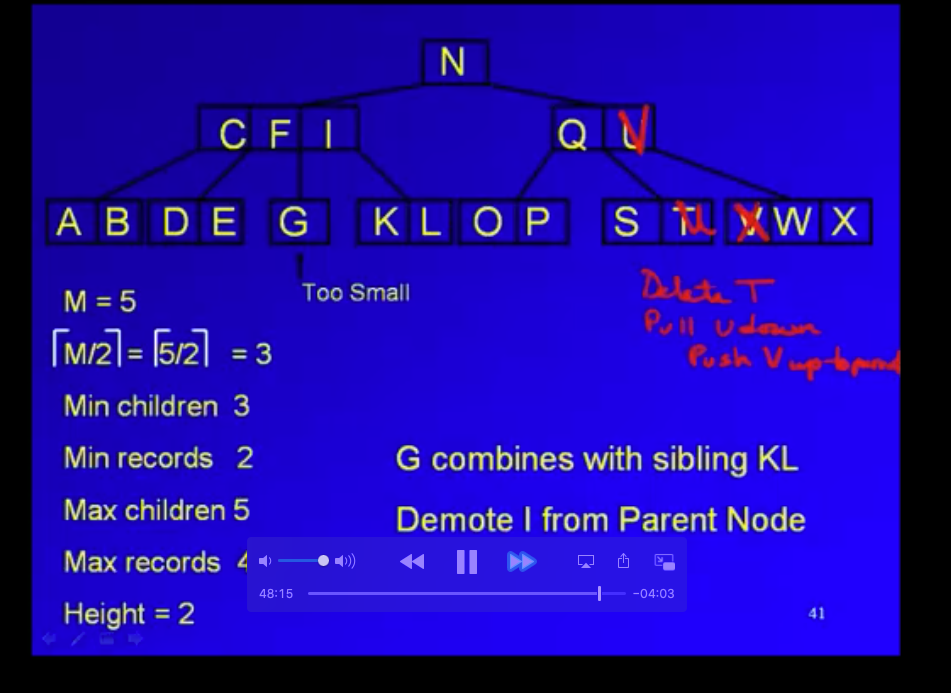

#### B-Trees

different from binary tree

- Introduction to B-trees
In a binary tree, each node has one key (the data) and up to two children. A B-tree with order K is a tree where nodes
 can have
 up to K-1 keys and up to K children. The order is the maximum number of children a node can have. Ex: In a B-tree with order 4, a nodes can have 1, 2, or 3 keys, and up to 4 children. B-trees have the following properties:

- A single node in a B-tree can contain multiple keys.
All keys in a B-tree must be distinct.
All leaf nodes must be at the same level.
An internal node with N keys must have N+1 children.
Keys in a node are stored in sorted order from smallest to largest.
Each key in a B-tree internal node has one left subtree and one right subtree. All left subtree keys are < that key, and all right subtree keys are > that key.

- An order 3 B-tree can have up to 2 keys per node. This root node contains the keys 10 and 20, which are ordered from smallest to largest.

- An internal node with 2 keys must have three children. The node with keys 10 and 20 has three children nodes, with
 keys 5, 15, and 25.


This is a valid tree:


more valid exmaples:


#### 2-3-4 tree
Remember that  A B-tree with order K is a tree where nodes can have up to K-1 keys and up to K children. 


#### Splitting a full node

> Splitting an internal node allocates 2 new nodes, each with a single key, and the middle key from the split node moves up into the parent node. Splitting the root node allocates 3 new nodes, each with a single key, and the root of the tree becomes a new node with a single key.

```
BTreeSplit(tree, node) {
   if (node is not full)
      return null
   nodeParent = node⇢parent
   splitLeft = new BTreeNode(node⇢A, node⇢left, node⇢middle1)
   splitRight = new BTreeNode(node⇢C, node⇢middle2, node⇢right)
   if (nodeParent is not null)
      BTreeInsertKeyWithChildren(nodeParent, node⇢B, splitLeft, splitRight)
   else {
      nodeParent = new BTreeNode(node⇢B, splitLeft, splitRight)
      tree⇢root = nodeParent
   }
   return nodeParent
}
```


### Inserting


This is how to insert into a tree using preemptive split:


### 2-3-4 Rotations


This image describes this:

> BTreeAddKeyAndChild operates on a non-full node, adding one new key and one new child to the node. The new key must be greater than all keys in the node, and all keys in the new child subtree must be greater than the new key. Ex: If the node has 1 key, the newly added key becomes key B in the node, and the child becomes the middle2 child.


> One of the keys in the node will move into the node's parent node during a left or right rotation, and one of the node's parent's keys will move into the sibling of the node.

> The rotation algorithm operates on a node, causing a net decrease of 1 key in that node. The key removed from the node moves up into the parent node, displacing a key in the parent that is moved to a sibling. No new nodes are allocated, nor existing nodes deallocated during rotation. The code simply copies key and child pointers.

### Fusion

> When rearranging values in a 2-3-4 tree during deletions, rotations are not an option for nodes that do not have a sibling with 2 or more keys. Fusion provides an additional option for increasing the number of keys in a node. A fusion is a combination of 3 keys: 2 from adjacent sibling nodes that have 1 key each, and a third from the parent of the siblings. Fusion is the inverse operation of a split. The key taken from the parent node must be the key that is between the 2 adjacent siblings. The parent node must have at least 2 keys, with the exception of the root.

> Fusion of the root node is a special case that happens only when the root and the root's 2 children each have 1 key. In this case, the 3 keys from the 3 nodes are combined into a single node that becomes the new root node.




## Non-root fusion

> Non-root fusion
For the non-root case, fusion operates on 2 adjacent siblings that each have 1 key. The key in the parent node that is between the 2 adjacent siblings is combined with the 2 keys from the two siblings to make a single, fused node. The parent node must have at least 2 keys.

> In the fusion algorithm below, the BTreeGetKeyIndex function returns an integer in the range [0,2] that indicates the index of the key within the node. The BTreeSetChild functions sets the left, middle1, middle2, or right child pointer based on an index value of 0, 1, 2, or 3, respectively


### Removal of node from tree

> Remove algorithm
Given a key, a 2-3-4 tree remove operation removes the first-found matching key, restructuring the tree to preserve all 2-3-4 tree rules. Each successful removal results in a key being removed from a leaf node. Two cases are possible when removing a key, the first being that the key resides in a leaf node, and the second being that the key resides in an internal node.

> A key can only be removed from a leaf node that has 2 or more keys. The preemptive merge removal scheme involves increasing the number of keys in all single-key, non-root nodes encountered during traversal. The merging always happens before any key removal is attempted. Preemptive merging ensures that any leaf node encountered during removal will have 2 or more keys, allowing a key to be removed from the leaf node without violating the 2-3-4 tree rules.

> To remove a key from an internal node, the key to be removed is replaced with the minimum key in the right child subtree (known as the key's successor), or the maximum key in the leftmost child subtree. First, the key chosen for replacement is stored in a temporary variable, then the chosen key is removed recursively, and lastly the temporary key replaces the key to be removed.


#### AVL trees, balanced binary trees

> In computer science, an AVL tree (named after inventors Adelson-Velsky and Landis) is a self-balancing binary search tree. ...
AVL trees are often compared with red–black trees because both support the same set of operations and take time for the basic operations.

balanced or not:


#### AVL rotations


right rotation:


#### AVL insertion


this is how to do a double insert where two rotations are neceasary:


#### AVL rotations


results:


notice the upper right left-right case where the left rotations happens first with the left subtree


the example below has




#### AVL insertion

> Insertion starts with the standard BST insertion algorithm. After inserting a node, all ancestors of the inserted node, from the parent up to the root, are rebalanced. A node is rebalanced by first computing the node's balance factor, then performing rotations if the balance factor is outside of the range [-1,1].

```
AVLTreeInsert(tree, node) {
   if (tree⇢root == null) {
      tree⇢root = node
      node⇢parent = null
      return
   }

   cur = tree⇢root
   while (cur != null) {
      if (node⇢key < cur⇢key) {
         if (cur⇢left == null) {
            cur⇢left = node
            node⇢parent = cur
            cur = null
         }
         else {
            cur = cur⇢left
         }
      }
      else {
         if (cur⇢right == null) {
            cur⇢right = node
            node⇢parent = cur
            cur = null
         }
         else
            cur = cur⇢right
      }
   }

   node = node⇢parent
   while (node != null) {
      AVLTreeRebalance(tree, node)
      node = node⇢parent
   }
}
```


Time complexity of avl insertion:

> The AVL insertion algorithm traverses the tree from the root to a leaf node to find the insertion point, then traverses back up to the root to rebalance. One node is visited per level, and at most 2 rotations are needed for a single node. Each rotation is an O(1) operation. Therefore, the runtime complexity of insertion is O(log N).


### AVL Tree Remove

```
AVLTreeRemoveNode(tree, node) {
   if (node == null)
      return false
        
   // Parent needed for rebalancing
   parent = node⇢parent
        
   // Case 1: Internal node with 2 children
   if (node⇢left != null && node⇢right != null) {
      // Find successor
      succNode = node⇢right
      while (succNode⇢left != null)
         succNode = succNode⇢left
            
      // Copy the value from the node
      node = Copy succNode
            
      // Recursively remove successor
      AVLTreeRemoveNode(tree, succNode)
            
      // Nothing left to do since the recursive call will have rebalanced
      return true
   }

   // Case 2: Root node (with 1 or 0 children)
   else if (node == tree⇢root) {
      if (node⇢left != null)
         tree⇢root = node⇢left
      else
         tree⇢root = node⇢right

      if (tree⇢root)
         tree⇢root⇢parent = null

      return true
   }

   // Case 3: Internal with left child only
   else if (node⇢left != null)
      AVLTreeReplaceChild(parent, node, node⇢left)
        
   // Case 4: Internal with right child only OR leaf
   else
      AVLTreeReplaceChild(parent, node, node⇢right)
        
   // node is gone. Anything that was below node that has persisted is already correctly
   // balanced, but ancestors of node may need rebalancing.
   node = parent
   while (node != null) {
      AVLTreeRebalance(tree, node)            
      node = node⇢parent
   }
   return true
}
```


### Red Black trees

> A red-black tree is a BST with two node types, namely red and black, and supporting operations that ensure the tree is balanced when a node is inserted or removed. The below red-black tree's requirements ensure that a tree with N nodes will have a height of O(log N).

- Every node is colored either red or black.
- The root node is black.
- A red node's children cannot be red.
- A null child is considered to be a black leaf node.
- All paths from a node to any null leaf descendant node must have the same number of black nodes.


### Hash table overview
A hash table is a data structure that stores unordered items by mapping (or hashing) each item to a location in an array (or vector). Ex: Given an array with indices 0..9 to store integers from 0..500, the modulo (remainder) operator can be used to map 25 to index 5 (25 % 10 = 5), and 149 to index 9 (149 % 10 = 9). A hash table's main advantage is that searching (or inserting / removing) an item may require only O(1), in contrast to O(N) for searching a list or to O(log N) for binary search.

In a hash table, an item's key is the value used to map to an index. For all items that might possibly be stored in the hash table, every key is ideally unique, so that the hash table's algorithms can search for a specific item by that key.

Each hash table array element is called a bucket. A hash function computes a bucket index from the item's key.


A common hash function uses the modulo operator %, which computes the integer remainder when dividing two numbers. Ex: For a 20 element hash table, a hash function of key % 20 will map keys to bucket indices 0 to 19.

A hash table's operations of insert, remove, and search each use the hash function to determine an item's bucket. Ex: Inserting 113 first determines the bucket to be 113 % 10 = 3.


#### Hash table collision

> Collisions
A collision occurs when an item being inserted into a hash table maps to the same bucket as an existing item in the hash table. Ex: For a hash function of key % 10, 55 would be inserted in bucket 55 % 10 = 5; later inserting 75 would yield a collision because 75 % 10 is also 5. Various techniques are used to handle collisions during insertions, such as chaining or open addressing. Chaining is a collision resolution technique where each bucket has a list of items (so bucket 5's list would become 55, 75). Open addressing is a collision resolution technique where collisions are resolved by looking for an empty bucket elsewhere in the table (so 75 might be stored in bucket 6). Such techniques are discussed later in this material.


### Good hashing functions

A good hash function minimizes collisions
A hash table is fast if the hash function minimizes collisions.

A perfect hash function maps items to buckets with no collisions. A perfect hash function can be created if the number of items and all possible item keys are known beforehand. The runtime for insert, search, and remove is O(1) with a perfect hash function.

A good hash function should uniformly distribute items into buckets. With chaining, a good hash function results in short bucket lists and thus fast inserts, searches, and removes. With linear probing, a good hash function will avoid hashing multiple items to consecutive buckets and thus minimize the average linear probing length to achieve fast inserts, searches, and removes. On average, a good hash function will achieve O(1) inserts, searches, and removes, but in the worst-case may require O(N).

A hash function's performance depends on the hash table size and knowledge of the expected keys. Ex: The hash function key % 10 will perform poorly if the expected keys are all multiples of 10, because inserting 10, 20, 30, ..., 90, and 100 will all collide at bucket 0.

### Chaining for hash buckets

> Chaining handles hash table collisions by using a list for each bucket, where each list may store multiple items that map to the same bucket. The insert operation first uses the item's key to determine the bucket, and then inserts the item in that bucket's list. Searching also first determines the bucket, and then searches the bucket's list. Likewise for removes.


### Linear probing


Using linear probing, a hash table insert algorithm uses the item's key to determine the initial bucket, linearly probes (or checks) each bucket, and inserts the item in the next empty bucket (the empty kind doesn't matter). If the probing reaches the last bucket, the probing continues at bucket 0. The insert algorithm returns true if the item was inserted, and returns false if all buckets are occupied.


the above is how removal from a hash table works.


### Direct hashing


> A direct access table has the advantage of no collisions: Each key is unique (by definition of a key), and each gets a unique bucket, so no collisions can occur. However, a direct access table has two main limitations.

> All keys must be non-negative integers, but for some applications keys may be negative.
The hash table's size equals the largest key value plus 1, which may be very large.


#### Hashing


### Password hashing function
> A password hashing function is a cryptographic hashing function that produces a hash value for a password. Databases for online services commonly store a user's password hash as opposed to the actual password. When the user attempts a login, the supplied password is hashed, and the hash is compared against the database's hash value. Because the passwords are not stored, if a database with password hashes is breached, attackers may still have a difficult time determining a user's password.


#### Bucket sort

 Bucket sort
Bucket sort is a numerical sorting algorithm that distributes numbers into buckets, sorts each bucket with an additional sorting algorithm, and then concatenates buckets together to build the sorted result. A bucket is a container for numerical values in a specific range. Ex: All numbers in the range 0 to 49 may be stored in a bucket representing this range. Bucket sort is designed for arrays with non-negative numbers.

Bucket sort first creates a list of buckets, each representing a range of numerical values. Collectively, the buckets represent the range from 0 to the maximum value in the array. For N buckets and a maximum value of M, each bucket represents `(M+1)/N` values. Ex: For 10 buckets and a maximum value of 49, each bucket represents a range of `(49+1)/10 = 5` values; the first bucket will hold values ranging from 0 to 4, the second bucket 5 to 9, and so on. Each array element is placed in the appropriate bucket. The bucket index is calculated as `number * (N / (M+1))`. Then, each bucket is sorted with an additional sorting algorithm. Lastly, all buckets are concatenated together in order, and copied to the original array.

```
BucketSort(numbers, numbersSize, bucketCount) {
   if (numbersSize < 1)
      return

   buckets = Create list of bucketCount buckets

   // Find the maximum value
   maxValue = numbers[0]
   for (i = 1; i < numbersSize; i++) {
      if (numbers[i] > maxValue)
         maxValue = numbers[i]
   }

   // Put each number in a bucket
   for each (number in numbers) {
      index = floor(number * bucketCount / (maxValue + 1))
      Append number to buckets[index]
   }

   // Sort each bucket
   for each (bucket in buckets)
      Sort(bucket)

   // Combine all buckets back into numbers list
   result = Concatenate all buckets together
   Copy result to numbers
}
```

> The term "bucket sort" is sometimes used to refer to a category of sorting algorithms, instead of a specific sorting algorithm. When used as a categorical term, bucket sort refers to a sorting algorithm that places numbers into buckets based on some common attribute, and then combines bucket contents to produce a sorted array.


### Hash resizing:

A hash table's load factor is the number of items in the hash table divided by the number of buckets. Ex: A hash table with 18 items and 31 buckets has a load factor of . The load factor may be used to decide when to resize the hash table.

An implementation may choose to resize the hash table when one or more of the following values exceeds a certain threshold:

Load factor
When using open-addressing, the number of collisions during an insertion
When using chaining, the size of a bucket's linked-list


load factor resize:


# LEcture notes

## Search strategies for when data is sorted like in a tree


1. simple search trees
2. avl trees (height balanced)
3. higher order b-trees
#### SEarch tree lecture notes

- trees are great, you can still access the whole data with in order traversal and inserts and deletes and searches are log(n) cost.

1. simple search tree
- start with sorted file/list
- left is left subtree, right is right subtree
- short and bushy tree.
- find middle item of list, make that root, recursively repeat.


this is the beginning tree:


if we delete 70, we delete the in-order successor


80 replaces 70


we pick the in-order successor 42 to replace the root 25. could have picked 22 in order predecessor too. it keeps the in order arrangement of the tree, it preserves the in order traversal of tree.

- the in-order successor will have no children or one child. If it has two children, the left child would be teh in-order successor.


2. AVL Trees (height balanced trees)

- the absolute value of height left sub tree - height right  tree < 1. this is the balance factor.
- everytime you do something to th tree, have to spend effort to rebalance
- these diff tree  types have different strategies to maintain short,bushy trees.

- balance factor for leaves is 0


3. B- Trees (higher order)
 - red-black
 - splay trees
 - 2-3 trees
 - 2-3-4 trees
 
 
- everytime you do something to th tree, have to spend effort to rebalance


- the above is a simple avl tree that shows balance factors. D is -1 because the right subtree is bigger and G is 1 because it is a root with a left subtree of height 1 and a right subtree of height 0 (counting nodes, not edges here, you could do either apparently). leaf nodes have a height of 0.


the LL rotation is shown above. 

The LR rotation is on the right. net effect though is the same as the other. F needs to replace G and G would be the right child. same result as LL rotation. in order traversal is BDEFG.


3. Let's move onto B-Trees (applies to higher order trees).

- all leaves are at the same level.


- look at lower right of image below. if key we're looking for something less than r1, we follow pointer 0 (p0), if it's less than r2 we follow pointer 1 (p1).
- higher order tree implies multiple pointers.
- ceiling of m/2 children at minimum per node. the slide is unclear. that number is a minimum number of children.


example:


 
 
 when inserting, splitsa re sometimes needed. Here two splits are needed:
 
 
 
 
 
 
 how to delete:
 
 
 
 
 
 borrow or shift strategy when deleting from a node that would reduce that node to have 1 key which is too small:
 
 
 
 
 - motivation for b-trees is that because you can store more records on a node
 
 
 
 ## Search strategies for when data is not sorted like in a tree
 
 #### Sequential search
 
 O(n/2) if item is in file
 O(n) if item is not.
 
 #### Transposition
 - the data is not sorted
 - organize by frequency of acccess. as data gets accessed, it moves to the front to make sequential access more efficient. it's a type of ordering on the fly.
 
 similar to shell and quadratic sort which optimizes a simpler strategy. this makes ssequentai lsearch more efficient.
 
 - if changes to access are gradual, transposition is good. if changes are drastic, sometimes transosition doesn't move the records to the front fast enough.
 
 ### move-to-the-front
 - when accessed, move the data right ot the front. responds quickly to pattern changes of access. steady state... move to the front is less desirable when changes are gradual. experiment between move-to-thefront and transposition.
 
 -you can compromise and insetad of switching with record in front, switch with record further up. make transpotiion faster by using larger jumps.
 
 - if all records are equally accessed, neither move to the front and transposition are not good candidates for access.
 
 
 ### Hashing
 
 -  attempts to be an O(1) search strategy. fixed time, not fast. sometimes this can be slow.
 
 -does single calculation on key to get address. function turns key into address function(key) = address
 - uses buckets - addressable unit of space. default is for bucket to hold 1, but buckets can hold more records. sequential search within bucket to store and retrive.
 - address is an area in a hash table, either an array, hard disk, other linear contiguous space.
 
 M = table size
 
 4 main hashing strategies:
 
 1. multipliation, kind of like random number geenrator
 2. division using modulo, most popular
 3. folding
 
 
 handle collsions that occur by rehashing and chaining
 
 #### Rehashing
 
 - use same hash function, run it again. or use variation. if use variatin, might only be able to do this a limited number of times before running out of variations.
 
 
 ### Chaining
 - use a linked list of colliding records
 - the overflow area needs extra space
 
 could use pointers to point to different locations in the array as a way of chaining. this is chaining not using a separate overflow area. It's kind of like linear probing but pointers are used in chaining to point t odifferent areas of the original space.
 
 
 ### Linear chaining
 Linear chaining in a very full table deteriorates to O(n). that's when you just move forward through file until available space is found
 - when deleting you need to mark deletes specially otherwise when seareching, deleted empty spaces might preemptively stop the search. Yo uneed to differentiate between empty spaces which should actually stop a search and empty spaces that used to ahve something in it.
 
 - hashing works better when table is bigger
 just make the table size bigger