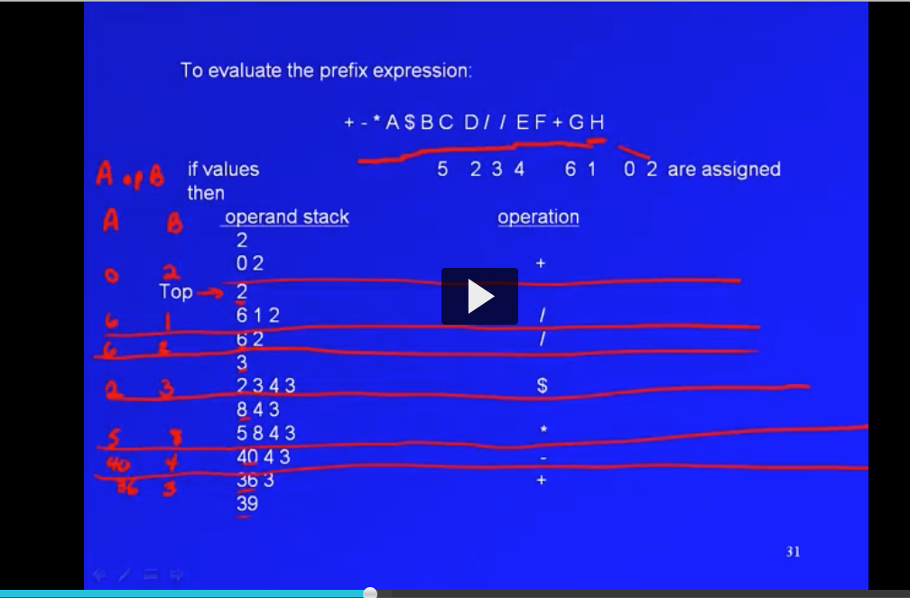
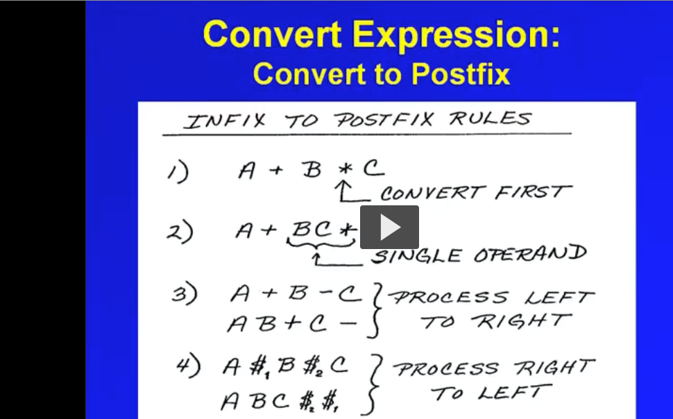
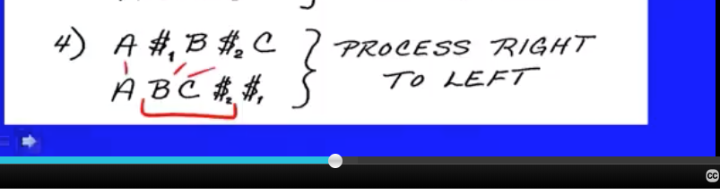
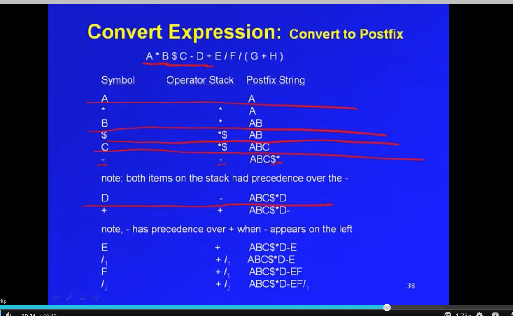
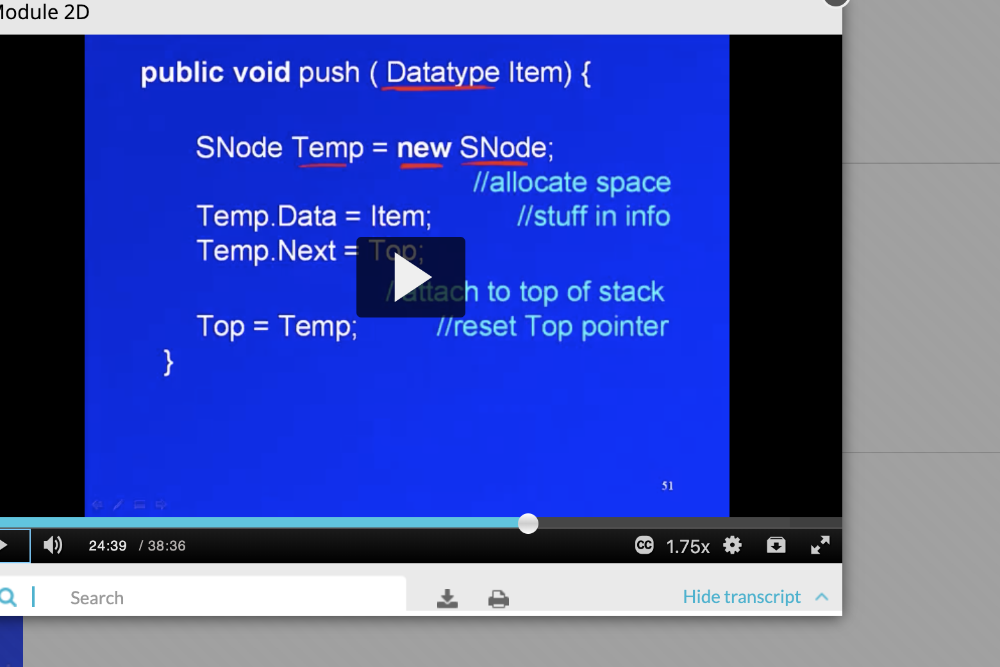

In prefix notation, the top of the stack is on the left, and you do A op B and you read the prefix equation from right to left. This is the algo:

__Infix to Postfix:__

To convert to postfix, evaluate highest precedence operators first:
The pattern is that we start with infix: operand, operator, operator string, and rewrite it as operand, operand, operator.
In step 2, we now have an operand that is BC* and that is a single operand. So we have operand, operator, operand remaining which is A+BC* and that gets converted to ABC*+ where BC* again is an operand. 

the right exponent is processed first when doing exponents. exponentiation is the exception to the left to right rule when doing infix to postfix.

__Steps from infix to postfix:__

The stack keeps all operators and output could be a file
- if you encounter an operand in the input, that goes to output or the file
    - if the next input is of equal precedence to the top of teh stack, the left most operator gets added to the output and then the input becomes top of stack
    - if the next input operator is of lower precedence than the top of stack, the top of stack gets added to output. Then check next top of stack operator. If top of stack oepratir is higher than the input operator, the top of stack operator gets sent to output.
    - if te input is higher precedence than the top of stack operator, we push teh input operator onto the stack. 
- treat parens as a subproblem. When you hit the right paren, pop the stack until the left paren
- when no more input, pop remaining operators on the stack

Left to right rule when there are operators of equal precedence. For postfix, if there's a - on top of the stack and an addition input like at 30:00 on module 2 video 2, then the - because it is left has higher precedence so it is popped and put on the right of input.

Implementing A stack using a LinkedList:

This is hte push:

