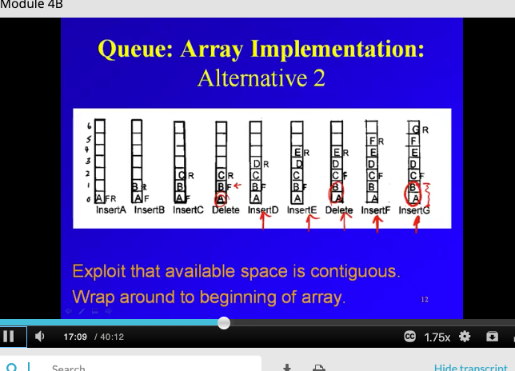
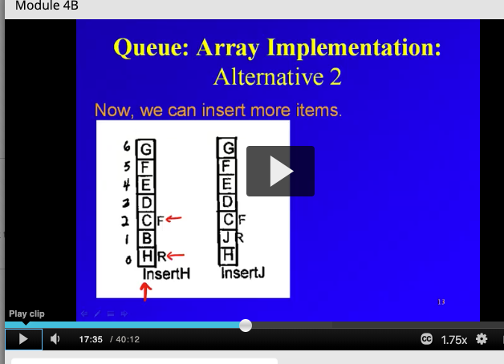
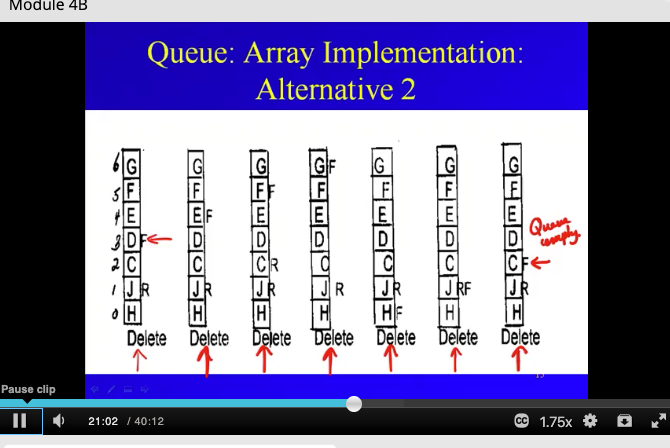
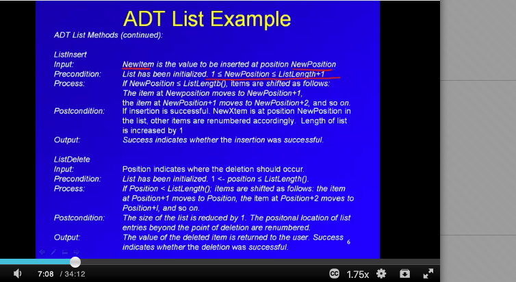
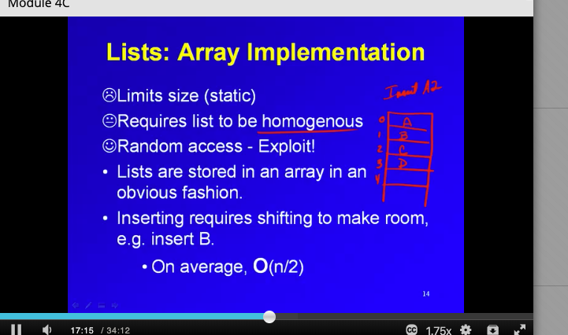
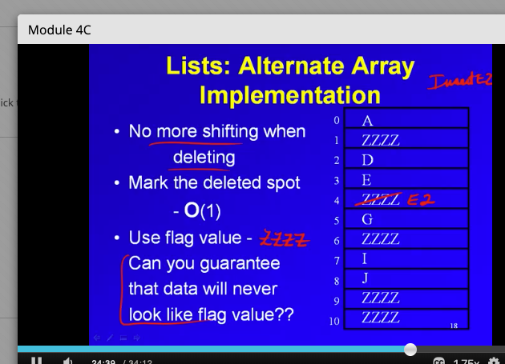
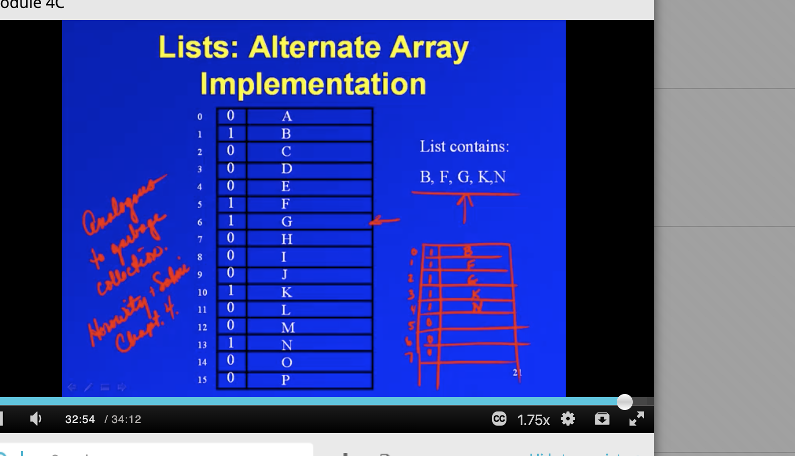

__Queues:__
- Oldest at the front may be deleted. 
- New items are inserted at the rear. 
- insertion at rear
- deletion at front

Queues are FIFO. ordering is chronological.

The ADT:
Peek needs to be in the ADT. With stacks, since they are LIFO, you could replace it with a pop and push, but with queues since they are FIFO and pushes are in the back of the queue, you can't really just replace it with anything.

4.5 Array-based lists
Both the search and remove operations have a worst case runtime complexity of O(N).
if the search element is in the index 2 spot: The search for 84 compares against 3 elements before returning 2.

IF you search for an element at index 4, 4 elmeents have to be compared.

Standard operations:
- queue insert, queue delete, constructor, data, front and rear pointers.
- optional methods: copy

__Array implementation for queue__
- msut be same type in queue.
- size limits, arrays are static allocation.
- exploits random access
- need read and front pointers.

one implementation:
- deletes just move the front pointer but data still in the array, but not in the queue.

alternative implementation:
you could delete items and have the first element in array be the front and not need a front pointer. But in this implementation of an array, you need to delete front item and not jsut move the front pointer.
- this is an improvmeent... you don't have garbage lying around and don't have false overflow. you can fully utilize array.
-downside: entire queue must shift on delete, this takes O(n) time.

alterantive 2:

-benefit, no shifting is needed so inserts and deletes are O(1)
- front pointer moves up when deletes happen. Read pointers move up when inserts happen.
- wrap arounds help use contiguous array space so that nothing is wasted. In diagram, A and B will be used once array is used up.
- However wrap arounds can happen that LOOK like if nothing happened. We can prevent this by keep track of length OR.
- have to track length
- front and rear can occur in either order.

problem: can't tell full state or empty state like this:

solution: can keep a length attribute. 

Implementation 2 is the standard array implementation of a queue.

__Linked List implementation for queue__
- queue needs to be homogenous
- no size limits
- need front and rear pointers.

- Each node has 'data' and a 'next'. Data could be any type.
- The ListQueue keeps front, rear, and optionally size.

Difference between queues and stacks:
- queues have more turnover than stacks.

__Lists__
- all locations are available for insertion and deletion, unlike stacks and queues which limit where you can insert and delete. 
- ordered collection
- no limit on number of items
- no limit on nature of items.

Can be implemented in different ways and will place restrictions.

Array implementation:

on average the inserts are O(N/2). Ones in the beginning are slow due to shifting, ones in back are fast.

Array implementation of List number 2:
- instead of shifting on insert and delete, we use flag vvalues when we delete a spot. no need to shift. Also, it gives us a place to do the insertion and less shifting is required. No shifting or a minimal amount of shifting is needed on inserts.

We could also use bits to mark deletes like here:

HEre we use bits 0 to mark that something is deleted. Downsize is that searching takes a lot longer because there are so many more deletes. We can shift and garbage collect the 0s when we need to too.

__Lists: Linked implementation__

- sequential access

List you can insert and delete anywhere. You think of a queue and stack as an access restricted lists. Queues and stacks are specific types of lists.

