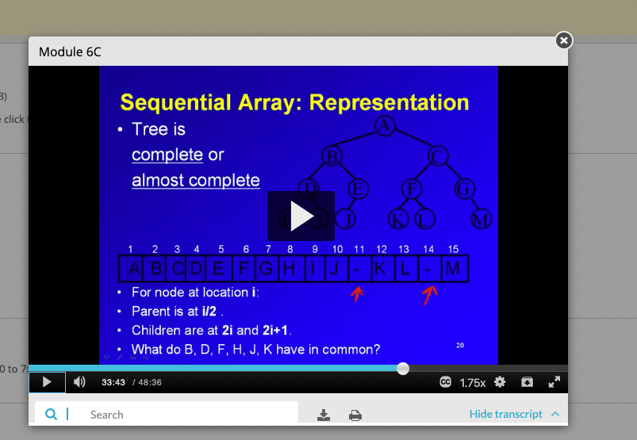
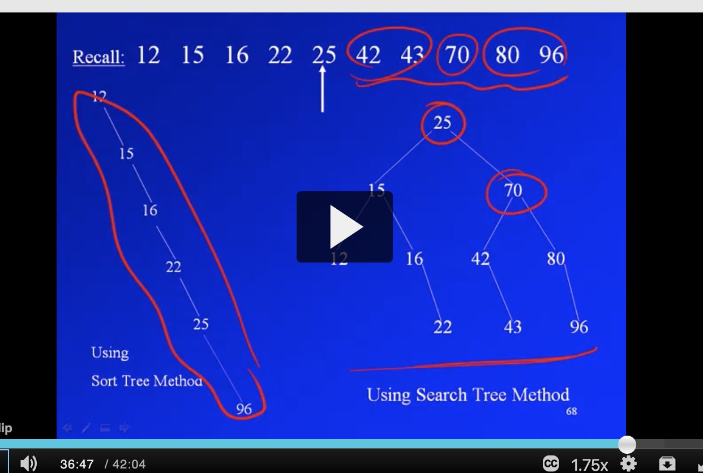

#Binary Tree

- different from a binary search tree which is a specific kind of binary tree.

In a list, each node has up to one successor. In a binary tree, each node has up to two children, known as a left child and a right child. "Binary" means two, referring to the two children. Some more definitions related to a binary tree:

Leaf: A tree node with no children.
Internal node: A node with at least one child.
Parent: A node with a child is said to be that child's parent. A node's ancestors include the node's parent, the parent's parent, etc., up to the tree's root.
Root: The one tree node with no parent (the "top" node).

###Depth, level, and height
A few additional terms:

- The link from a node to a child is called an edge.
- A node's depth is the **number of edges** on the path from the root to the node. The root node thus has depth 0.
- All nodes with the same depth form a tree level.
- A tree's height is the largest depth of any node. A tree with just one node has height 0.

| height   | leaves      |  total nodes     |
| -------- | ----------- |------  |
| 0  | 1    |    1   |
| 1  | 2    |    3   |
| 2|   4|        7   |
|3|8|15
A graph's **minimum spanning** tree is a subset of the graph's edges that connect all vertices in the graph together with the minimum sum of edge weights. The graph must be weighted and connected. A connected graph contains a path between every pair of vertices. A minimum spanning tree is a set of edges.

###Binary search trees
An especially useful form of binary tree is a binary search tree (BST), which has an ordering property that any node's left subtree keys ≤ the node's key, and the right subtree's keys ≥ the node's key. That property enables fast searching for an item, as will be shown later.

###Searching a BST vs a list:
To search nodes means to find a node with a desired key, if such a node exists. A BST may yield faster searches than a list. Searching a BST starts by visiting the root node (which is the first currentNode below):

###Best case BST search runtime
Searching a BST in the worst case requires H + 1 comparisons, meaning O(H) comparisons, where H is the tree height. Ex: A tree with a root node and one child has height 1; the worst case visits the root and the child: 1 + 1 = 2. A major BST benefit is that an N-node binary tree's height may be as small as O(logN), yielding extremely fast searches. Ex: A 10,000 node list may require 10,000 comparisons, but a 10,000 node BST may require only 14 comparisons.

A binary tree's height can be minimized by keeping all levels full, except possibly the last level. Such an "all-but-last-level-full" binary tree's height is H = logN rounded down.

So for 7 nodes, the height is 2. For 15 nodes, the height is 3. log base 2 to the 15 is 3.something and so rounded down is 3. 15 notes is a BST with a tree with a height of 3 and 15 nodes.

**Searching what is the worst case scenario for a BST?**
Searching, what is the worst case? In the worst case, searching a perfect BST requires (height of BST + 1) comparisons. So for 7 nodes which is a height of 2, it's log base 2 7 (rounded down) + 1 = 3.
For searching, the worset case scenario is height plus 1

###Inserting into a BST randomly
Recall that a tree's height is the maximum edges from the root to any leaf and The minimum N-node binary tree height is h = floor of logbase2N, achieved when each level is full except possibly the last. The maximum N-node binary tree height is N - 1 (the - 1 is because the root is at height 0).
-  Inserting items in random order naturally keeps a BST's height near the minimum. In contrast, inserting items in nearly-sorted order leads to a nearly-maximum tree height.

 A main benefit of a BST is that inserts require only O() iterations to find the proper insert location in a nearly-full N-node tree.
 
 
 ###Max Heap
 
 A max-heap is a binary tree that maintains the simple property that a node's key is greater than or equal to the node's childrens' keys. (Actually, a max-heap may be any tree, but is commonly a binary tree). Because x ≥ y and y ≥ z implies x ≥ z, the property results in a node's key being greater than or equal to all the node's descendants' keys. Therefore, a max-heap's root always has the maximum key in the entire tree.
 
 
 ## Priority Queue
 
Implementing priority queues with heaps
A priority queue is commonly implemented using a heap. A heap will keep the highest priority item in the root node and allow access in O(1) time. Adding and removing items from the queue will operate in worst-case O(logN) time. Access is constant since you just take the top of hte heap.
- Push and pop operate have runtime O(logN). All other operations happen in constant time. 

## Trees
If you want to determine trees are the same, like a graph, orientation doesn't matter. But count vertices and edges and that's a start. Look at the out-degree pattern too... the edges coming out from each vertex.

- Trees the arrows always go down, but you don't have to draw the arrow
- The leaves of a tree always have out degree of 0, they are sinks.

###Definitions for trees
- a **regular** tree, ech node has 0 or m vertices. Each node has teh same amount of edges except for the leaves. Each vertex has 0 or m children.
- a **complete** tree is regular and has all the leaves at the same level k.
- an almost complete tree is one where the missing nodes are on the right of the highest/bottom level.

- a complete  binary tree with height k has 2^k leaves and 2^(k+1) - 1 total nodes. so if k = 2, height is 2 meaning... then the total leaves are 4 and total nodes = 7. so the total nodes is 2^(k+1) - 1.
At level k = 3, leaves = 8, nodes = 15.

## Binary tree ADT
What's our wish list of methods?
- constructor - initialize empty tree
- MakeTree - create tree with 1 value as root with no children.
- setLeft - attach value as left child
- setRight
- displayTree - optional
- TraverseTree
- SEarchTree - look for specified value.
- deleteNode
- dataSection with reference to root, number of nodes, height and actual data in tree

## Ways to implement tree
- sequential array implementation
- linked representation.

- if it's near complete, only a few array slots are unused.

## Tree visiting

- 3 methods of visiting are preorder, in order, postorder. The difference is when the parent or root node is visited. in Inorder visiting, the node is visited in the middle. 
The left node would be visited first, then the parent node, then the right node. So in a three node tree where A is the parent of B and C, the order would be B, A, C.
- In preorder visiting, the parent node is visited first. So in a tree where A is the parent and has children B and C, the order would be A, B, C. 
- in Post order, the parent is visited last. So in a tree where A is the parent and has children B and C, the order would be B, C, A.

## Threads
- threads are pointers to the inOrder successor/the threads tell the node where to go next when tarversing the tree inOrder, not pointers to children. Only in InOrder arrangements of trees.

Any tree that is built by putting smaller items to the left and larger to the right will yeild the sorted order of all the data when you do an inOrder traversal and will yield values in monotonically increasing order.

To build a short and bushy tree, we and "balanced", is to:
- get the data in sorted order, 
- then use middle item as teh root
- each half becomes a subtree
- left half becomes the left subtree
- right half becomes the right subtree
- this is recursive.

Above is called a search tree and is build using this search tree method. It results in a much more balanced tree.

This is the binary search tree. Remember a binary tree without the word search merely means a tree where each node has two children.
