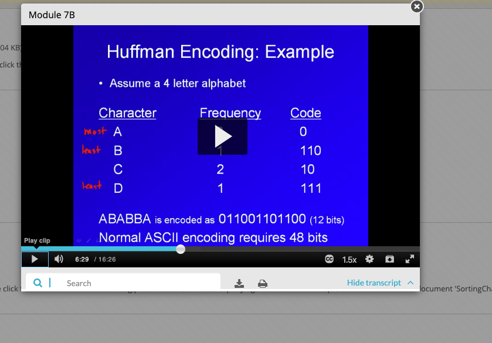
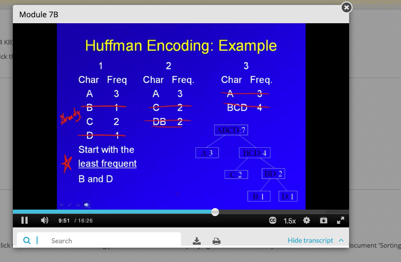
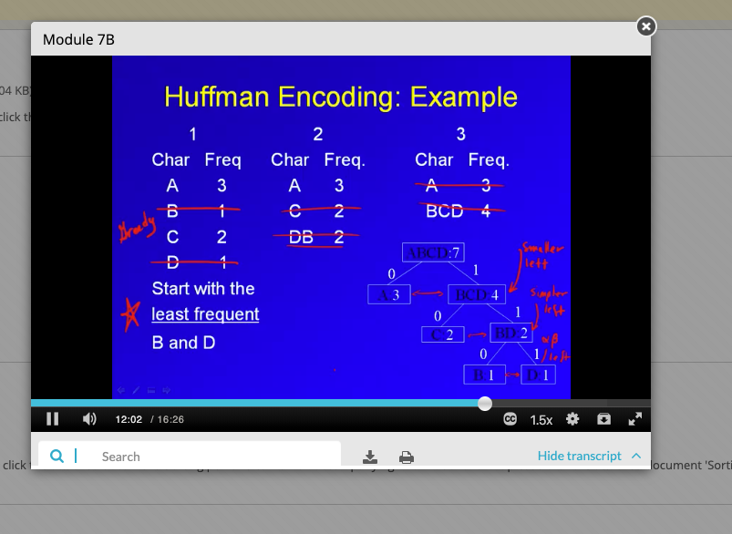
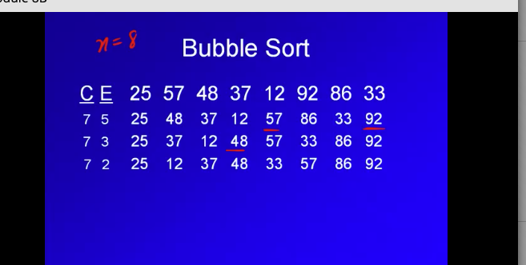
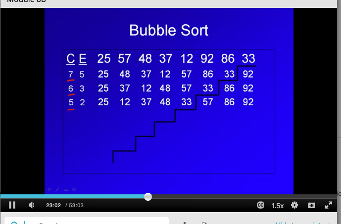
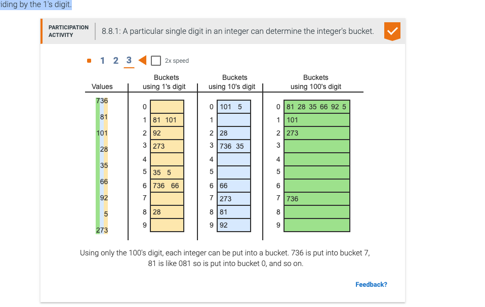
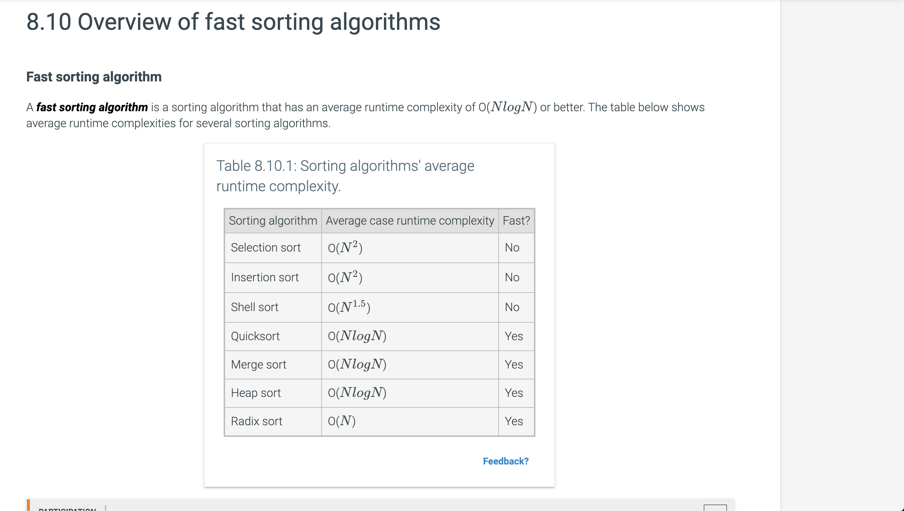
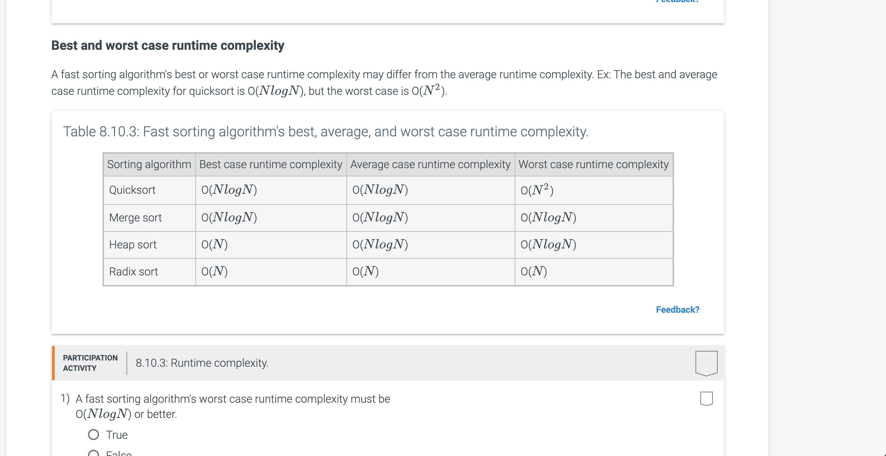

## Sorting
Sorting is the process of converting a list of elements into ascending (or descending) order. For example, given a list of numbers (17, 3, 44, 6, 9), the list after sorting is (3, 6, 9, 17, 44). You may have carried out sorting when arranging papers in alphabetical order, or arranging envelopes to have ascending zip codes (as required for bulk mailings).

The challenge of sorting is that a program can't "see" the entire list to know where to move an element. Instead, a program is limited to simpler steps, typically observing or swapping just two elements at a time. So sorting just by swapping values is an important part of sorting algorithms.

## Bubble sort
Bubble sort is a sorting algorithm that iterates through a list, comparing and swapping adjacent elements if the
 second element is less than the first element. Bubble sort uses nested loops. Given a list with N elements, the outer i-loop iterates N times. Each iteration moves the  largest element into sorted position. The inner j-loop iterates through all adjacent pairs, comparing and swapping adjacent elements as needed, except for the last i pairs that are already in the correct position,.

Because of the nested loops, bubble sort has a runtime of O(N^2). Bubble sort is often considered impractical for real
-world use because many faster sorting algorithms exist.

```
BubbleSort(numbers, numbersSize) {
   for (i = 0; i < numbersSize - 1; i++) {
      for (j = 0; j < numbersSize - i - 1; j++) {
         if (numbers[j] > numbers[j+1]) {
            temp = numbers[j]
            numbers[j] = numbers[j + 1]
            numbers[j + 1] = temp
         }
      }
   }
}
```
## Quick sort

Quicksort
Quicksort is a sorting algorithm that repeatedly partitions the input into low and high parts (each part unsorted), and then recursively sorts each of those parts. To partition the input, quicksort chooses a pivot to divide the data into low and high parts. The pivot can be any value within the array being sorted, commonly the value of the middle array element. Ex: For the list (4, 34, 10, 25, 1), the middle element is located at index 2 (the middle of indices 0..4) and has a value of 10.

To partition the input, the quicksort algorithm divides the array into two parts, referred to as the low partition
 and the high partition. All values in the low partition are less than or equal to the pivot value. All values in the high partition are greater than or equal to the pivot value. The values in each partition are not necessarily sorted. Ex: Partitioning (4, 34, 10, 25, 1) with a pivot value of 10 results in a low partition of (4, 10, 1) and a high partition of (34, 25). Values equal to the pivot may appear in either or both of the partitions.

The partitioning part:
Partitioning algorithm
The partitioning algorithm uses two index variables l and h (low and high), initialized to the left and right sides
 of the current elements being sorted. As long as the value at index l is less than the pivot value, the algorithm
  increments l, because the element should remain in the low partition. Likewise, as long as the value at index h is
   greater than the pivot value, the algorithm decrements h, because the element should remain in the high partition
   . Then, if l >= h, all elements have been partitioned, and the partitioning algorithm returns h, which is the index of the last element in the low partition. Otherwise, the elements at indices l and h are swapped to move those elements to the correct partitions. The algorithm then increments l, decrements h, and repeats.


```
int partition(numbers, i, k) {   
   /* Initialize variables */
   
   /* Pick middle value as pivot */
   midpoint = i + (k - i) / 2
   pivot = numbers[midpoint]

   l = i
   h = k
   
   while (!done) {
      /* Increment l while numbers[l] < pivot */
      while (numbers[l] < pivot) {
         ++l
      }
      
      /* Decrement h while pivot < numbers[h] */
      while (pivot < numbers[h]) {
         --h
      }
/* If there are zero or one items remaining,
         all numbers are partitioned. Return h */
      if (l >= h) {
         done = true
      }
      else {
         /* Swap numbers[l] and numbers[h],
            update l and h */
         temp = numbers[l]
         numbers[l] = numbers[h]
         numbers[h] = temp
         
         ++l
         --h
      }
   }
   return h
}
```

## typical quicksort runtime:
Quicksort runtime
The quicksort algorithm's runtime is typically O(N * log N). Quicksort has several partitioning levels , the first
 level dividing the input into 2 parts, the second into 4 parts, the third into 8 parts, etc. At each level, the
  algorithm does at most N comparisons moving the l and h indices. If the pivot yields two equal-sized parts, then there will be log N levels, requiring the N * log N comparisons.

## Worst case runtime for quicksort
For typical unsorted data, such equal partitioning occurs. However, partitioning may yield unequal sized part in some
 cases. If the pivot selected for partitioning is the smallest or largest element, one partition will have just 1
  element, and the other partition will have all other elements. If this unequal partitioning happens at every level
  , there will be N - 1 levels, yielding (N-1)*N, which is O(N^2). So the worst case runtime for the quicksort
   algorithm is O(N^2). Fortunately, this worst case runtime rarely occurs.
 
 
How many total comparisons are required to sort a list of 1024 elements?

1047552
(1024 - 1) * 1024 = 1023 * 1024 = 1047552 comparisons.
why?
At each level, the algorithm does at most N comparisons moving the l and h indices. Also, if the pivot selected for
 partitioning is the smallest or largest element, one partition will have just 1 element, and the other partition will have all other elements. If this unequal partitioning happens at every level, there will be N - 1 levels,
 
 so n*n-1 = 1024*1023 = 1047552 comparions for a time complexity worse case of quicksort.
 
 
 
 ## Lecture notes
 
 - codes are different from ciphers. ciphers just sub one symbol for another but are too amendable to pattern
  analysis. Codes are more complex.
 - huffman encoding useful for data compression. more frequently used letters get shorter codes. 
 - HE is binary, only uses 1 and 0. 
 - avoids pattern and frequency analysis
 - most frequency latters get the shortest codes. less frequent letters get the longest codes.
 
 example:
 
 
 - huffman encoding is shorter and smaller than ASCII which woiuld use 48 bits here. There is compression here with
  huffman encoding
  
 - how to build the encoding?
 We use a binary tree. we build frequency nodes where each node as the letter and frequency. The parent is the
  combined alphbetic label and frequency. we combine the two letters and enter them back into the list which is hte
   second column in this slide:
   
   


we then label the branches. 0 to the left branches, 1 to the right branches.



say yo uhave a messages: 011001101100

the first 0 goes to a
 the second 1 takes us right, the third 1 takes us right, the 0 takes us to a root node B. So 110 is B. 
 
 
 ## Types of sorts
 
 - exchange sorts
 - insertion sorts
 - selection sorts
 - merge sorts
 
 
 #### Bubble sort:
 - simple, inefficient
 - needs to be done in an array
 - good for small data files
 - simple double nested loop


 
 - bubble sort basically on each pass moves the largest item to the back
 - along the way, certain large items are moved as far right as possible too.
 - C is the number of comparisons, E is the number of exhchanges, the red underlined are large items are that moved
  as far right as possible
- along the way we stop looking at the right end because there's no need to look at it anymore after the first pass
. we reduce number of comparisions on the way.



#### What is the cost of Bubble?
- worst case is sigma i from i = 0 to n. That's teh close form summation which = n(n+1)/2. That represents the number
 of comparisions only.  iyt's quadratic 1/2n^2 + 1/2n. Worst case is if you do an exhcnage also every comparison
 : sigma 2i from i = 0 to n.
- if the file was reversed order: 5,4,3,2,1. Does every comparions and every exchange, that's the n^2 + n worst case
 scenario
- if the file was ordered 1,2,3,4,5. no exchanges and 4 compariosns, stop after 1 pass. That's the best casd scenario
. linear performance if file is in order.


#### Quicksort

- efficient
- recursive manner
- usage of a pivot, need to partition, repeat that process until array is sorted... that's the recursion

cost to partition: o(n)
to sort using quicksort usually is: n*logn, if worst case is n^2 or quadratic.
- needs to be in an array so can do random access of the array for quicksort.


#### Selection sort

Selection sort is a sorting algorithm that treats the input as two parts, a sorted part and an unsorted part, and
 repeatedly selects the proper next value to move from the unsorted part to the end of the sorted part. The index
  variable i denotes the dividing point. Elements to the left of i are sorted, and elements including and to the
   right of i are unsorted. All elements in the unsorted part are searched to find the index of the element with the
    smallest value. The variable indexSmallest stores the index of the smallest element in the unsorted part. Once
     the element with the smallest value is found, that element is swapped with the element at location i. Then, the
      index i is advanced one place to the right, and the process repeats. 


- Selection sort may require a large number of comparisons. The selection sort algorithm runtime is O(N^2). If a list
 has N elements, the outer loop executes N - 1 times. For each of those N - 1 outer loop executions, the inner loop
  executes an average of n/2 times. So the total number of comparisons is proportional to (n-1) * n/2, or O(N^2). Other
   sorting algorithms involve more complex algorithms but have faster execution times.
   
-1) How many times longer will sorting a list of 20 elements take compared to sorting a list of 10 elements?
It will takes 20^2/10^2 = 4 since the algo time complexity is n^2.

-2) Selection sort's runtime grows quadratically with the input size. If the input increases in size by X times, the runtime increases X times.
So that's why sorting a list of 500 takes 100 times longer than a list of 50. 500 is 10x 50 and so the runtime
 increases by 100x.


#### Quickselect

Quickselect is an algorithm that selects the  smallest element in a list. Ex: Running quickselect on the list (15, 73, 5, 88, 9) with k = 0, returns the smallest element in the list, or 5.

For a list with N elements, quickselect uses quicksort's partition function to partition the list into a low partition containing the X smallest elements and a high partition containing the N-X largest elements. The  smallest element is in the low partition if k is ≤ the last index in the low partition, and in the high partition otherwise. Quickselect is recursively called on the partition that contains the  element. When a partition of size 1 is encountered, quickselect has found the  smallest element.

Quickselect partially sorts the list when selecting the  smallest element.

The best case and average runtime complexity of quickselect are both O(). In the worst case, quickselect may sort the entire list, resulting in a runtime of O().


#### insertion sort

Insertion sort algorithm
Insertion sort is a sorting algorithm that treats the input as two parts, a sorted part and an unsorted part, and repeatedly inserts the next value from the unsorted part into the correct location in the sorted part.


```
for (i = 1; i < numbersSize; ++i) {
   j = i
   // Insert numbers[i] into sorted part 
   // stopping once numbers[i] in correct position
   while (j > 0 && numbers[j] < numbers[j - 1]) {
         
      // Swap numbers[j] and numbers[j - 1]
      temp = numbers[j]
      numbers[j] = numbers[j - 1]
      numbers[j - 1] = temp
      --j
   }
}
```

- The index variable i denotes the starting position of the current element in the unsorted part. Initially, the
 first element (i.e., element at index 0) is assumed to be sorted, so the outer for loop initializes i to 1. The
  inner while loop inserts the current element into the sorted part by repeatedly swapping the current element with
   the elements in the sorted part that are larger. Once a smaller or equal element is found in the sorted part, the
    current element has been inserted in the correct location and the while loop terminates.

-Insertion sort's typical runtime is O(N^2). If a list has N elements, the outer loop executes N - 1 times. For each
 outer loop execution, the inner loop may need to examine all elements in the sorted part. Thus, the inner loop
  executes on average n/2 times. So the total number of comparisons is proportional to (n-1)*(n/2), or O(N^2). Other
   sorting algorithms involve more complex algorithms but faster execution.
   
- For each outer loop execution, if the element is already in sorted position, only a single comparison is made. Each
 element not in sorted position requires at most N comparisons. If there are a constant number, C, of unsorted
  elements, sorting the N - C sorted elements requires one comparison each, and sorting the C unsorted elements
   requires at most N comparisons each. The runtime for nearly sorted inputs is O((N - C) * 1 + C * N) = O(N). This
    makes sense because the unsorted part needs at most N comparisons but if everything is sorted... only 1
     comparison needs to be made and then we move on.
     
     
     
#### Shell sort
- Shell sort is a sorting algorithm that treats the input as a collection of interleaved lists, and sorts each list individually with a variant of the insertion sort algorithm. Shell sort uses gap values to determine the number of interleaved lists. A gap value is a positive integer representing the distance between elements in an interleaved list. For each interleaved list, if an element is at index i, the next element is at index i + gap value.

- use several gap values:
Shell sort begins by choosing a gap value K and sorting K interleaved lists in place. Shell sort finishes by performing a standard insertion sort on the entire array. Because the interleaved parts have already been sorted, smaller elements will be close to the array's beginning and larger elements towards the end. Insertion sort can then quickly sort the nearly-sorted array
- Shell sort algorithm
Shell sort begins by picking an arbitrary collection of gap values. For each gap value K, K calls are made to the insertion sort variant function to sort K interleaved lists. Shell sort ends with a final gap value of 1, to finish with the regular insertion sort.

Shell sort tends to perform well when choosing gap values in descending order. A common option is to choose powers of
 2 minus 1, in descending order. Ex: For an array of size 100, gap values would be 63, 31, 15, 7, 3, and 1. This gap
  selection technique results in shell sort's time complexity being no worse than O(N^(3/2))
  
- ShellSort will produce a sorted array either way, but the order of gap values can affect efficiency. Ex: Sorting the array (88, 22, 33, 44, 55, 66, 77, 11) with gaps (3, 7, 1) requires 9 swaps total. Sorting the same array with gaps (7, 3, 1) requires only 1 swap.


#### Heap sort
- Heapsort is a sorting algorithm that takes advantage of a max-heap's properties by repeatedly removing the max and building a sorted array in reverse order. An array of unsorted values must first be converted into a heap. The heapify operation is used to turn an array into a heap. Since leaf nodes already satisfy the max heap property, heapifying to build a max-heap is achieved by percolating down on every non-leaf node in reverse order.

Heapsort overview
Heapsort begins by heapifying the array into a max-heap and initializing an end index value to the size of the array minus 1. Heapsort repeatedly removes the maximum value, stores that value at the end index, and decrements the end index. The removal loop repeats until the end index is 0.


#### Merge sort

- Merge sort is a sorting algorithm that divides a list into two halves, recursively sorts each half, and then merges
 the sorted halves to produce a sorted list. The recursive partitioning continues until a list of 1 element is reached, as list of 1 element is already sorted.
- Merge sort partitioning
The merge sort algorithm uses three index variables to keep track of the elements to sort for each recursive function call. The index variable i is the index of first element in the list, and the index variable k is the index of the last element. The index variable j is used to divide the list into two halves. Elements from i to j are in the left half, and elements from j + 1 to k are in the right half.

Merge sort merges the two sorted partitions into a single list by repeatedly selecting the smallest element from either the left or right partition and adding that element to a temporary merged list. Once fully merged, the elements in the temporary merged list are copied back to the original list.


runtime:
- The merge sort algorithm's runtime is O(N *log N). Merge sort divides the input in half until a list of 1 element
 is reached, which requires log N partitioning levels. At each level, the algorithm does about N comparisons selecting and copying elements from the left and right partitions, yielding N * log N comparisons.
 
space:
- Merge sort requires O(N) additional memory elements for the temporary array of merged elements. For the final merge operation, the temporary list has the same number of elements as the input. Some sorting algorithms sort the list elements in place and require no additional memory, but are more complex to write and understand.
- For N elements, the number of levels is log base2 to the N. log 8 = 3.


#### Radix sort
- Buckets
Radix sort is a sorting algorithm designed specifically for integers. The algorithm makes use of a concept called buckets and is a type of bucket sort.

Any array of integer values can be subdivided into buckets by using the integer values' digits. A bucket is a
 collection of integer values that all share a particular digit value. Ex: Values 57, 97, 77, and 17 all have a 7 as
  the 1's digit, and would all be placed into bucket 7 when subdividing by the 1's digit. weird so far. 
  
 

- Radix sort algorithm
Radix sort is a sorting algorithm specifically for an array of integers: The algorithm processes one digit at a time starting with the least significant digit and ending with the most significant. Two steps are needed for each digit. First, all array elements are placed into buckets based on the current digit's value. Then, the array is rebuilt by removing all elements from buckets, in order from lowest bucket to highest.
- Numbers are taken out of buckets, in order from lowest bucket to highest, rebuilding the array.
- The process is repeated for the 10's digit. First, the array numbers are placed into buckets based on the 10's digit.
-The items are copied from buckets back into the array. Since all digits have been processed, the result is a sorted array


```
RadixSort(array, arraySize) {
   buckets = create array of 10 buckets

   // Find the max length, in number of digits
   maxDigits = RadixGetMaxLength(array, arraySize)
        
   // Start with the least significant digit
   pow10 = 1
   for (digitIndex = 0; digitIndex < maxDigits; digitIndex++) {
      for (i = 0; i < arraySize; i++) {
         bucketIndex = abs(array[i] / pow10) % 10
         Append array[i] to buckets[bucketIndex]
      }
      arrayIndex = 0
      for (i = 0; i < 10; i++) {
         for (j = 0; j < buckets[i].size(); j++)
            array[arrayIndex++] = buckets[i][j]
      }
      pow10 = 10 * pow10
      Clear all buckets
   }
}


// Returns the maximum length, in number of digits, out of all elements in the array
RadixGetMaxLength(array, arraySize) {
   maxDigits = 0
   for (i = 0; i < arraySize; i++) {
      digitCount = RadixGetLength(array[i])
      if (digitCount > maxDigits)
         maxDigits = digitCount
   }
   return maxDigits
}

// Returns the length, in number of digits, of value
RadixGetLength(value) {
   if (value == 0)
      return 1

   digits = 0
   while (value != 0) {
      digits = digits + 1
      value = value / 10
   }
   return digits
}
```


#### topological sort
- A topological sort of a directed, acyclic graph produces a list of the graph's vertices such that for every edge from a vertex X to a vertex Y, X comes before Y in the list.
- so look at the graph first, and then the list. not every node in the list in order has to be connected in the graph.
- For every edge from a vertex X to a vertex Y in the graph, X comes before Y in the list.


#### fast sorting

- Fast sorting algorithm
A fast sorting algorithm is a sorting algorithm that has an average runtime complexity of O() or better. The table below shows average runtime complexities for several sorting algorithms.



avg times could be different from best and worst case times.



#### Searching and algos:
- Algorithms
An algorithm is a sequence of steps for accomplishing a task. Linear search is a search algorithm that starts from the beginning of a list, and checks each element until the search key is found or the end of the list is reached.


#### Algorithm search
- Algorithm runtime
An algorithm's runtime is the time the algorithm takes to execute. If each comparison takes 1 µs (1 microsecond), a linear search algorithm's runtime is up to 1 s to search a list with 1,000,000 elements, 10 s for 10,000,000 elements, and so on. Ex: Searching Amazon's online store, which has more than 200 million items, could require more than 3 minutes.

An algorithm typically uses a number of steps proportional to the size of the input. For a list with 32 elements, linear search requires at most 32 comparisons: 1 comparison if the search key is found at index 0, 2 if found at index 1, and so on, up to 32 comparisons if the the search key is not found. For a list with N elements, linear search thus requires at most N comparisons. The algorithm is said to require "on the order" of N comparisons.